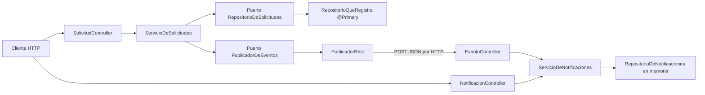
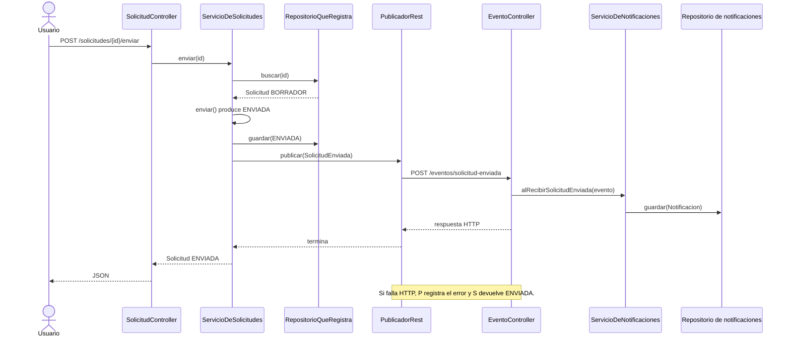
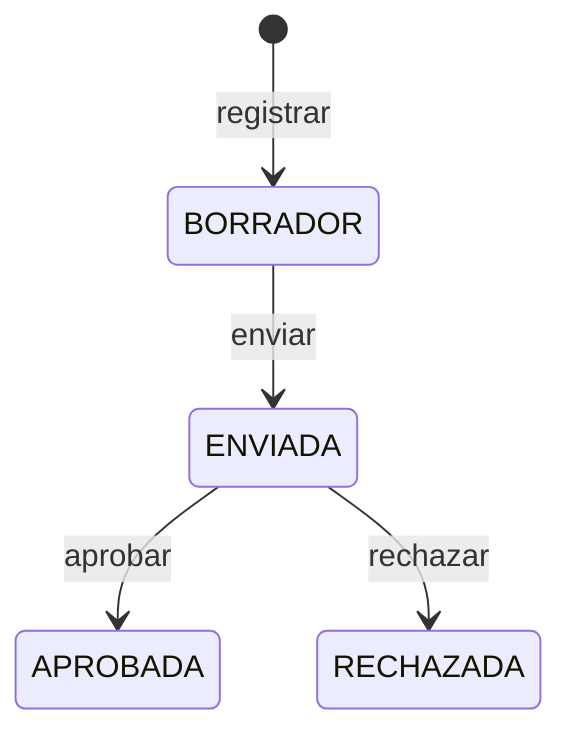
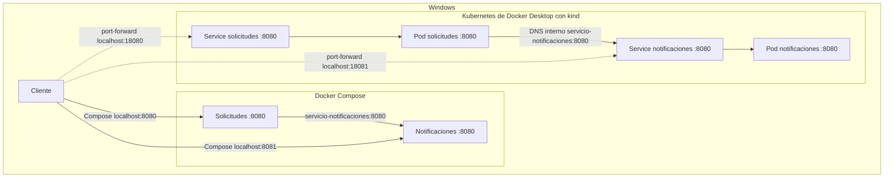

# Diagramas y flujos de arquitectura

ARKA-Lite consta de **dos aplicaciones Spring Boot independientes**. El cliente usa la API de solicitudes; al enviar una solicitud, esta llama por HTTP a notificaciones. Cada aplicación tiene su propio `pom.xml`, proceso y almacenamiento en memoria. Para recorrer clases y anotaciones concretas, consulte [componentes Java](01-componentes-java.md).

## Componentes y dependencias

[Fuente Mermaid: 03-componentes.mmd](03-componentes.mmd)

`RepositorioEnMemoria` también implementa el puerto de solicitudes, pero `@Primary` hace que Spring inyecte `RepositorioQueRegistra`. Ambos mantienen sus propios mapas; el adaptador elegido registra cada escritura. Los controladores son adaptadores de entrada, mientras que los repositorios y `PublicadorRest` son adaptadores de salida. El dominio no importa clases HTTP ni de Spring.

## Qué ocurre al enviar una solicitud

[Fuente Mermaid: 04-secuencia-envio.mmd](04-secuencia-envio.mmd)

El evento es un `record` JSON con `id` y `tipo` definido en ambos servicios. Se transporta mediante un **POST HTTP síncrono**, no por una cola de mensajes. `PublicadorRest` captura excepciones de comunicación y no reintenta. Como el estado se guarda antes de llamar a notificaciones, una solicitud puede quedar `ENVIADA` sin que exista una notificación correspondiente.

## Estados de una solicitud

[Fuente Mermaid: 05-estados-solicitud.mmd](05-estados-solicitud.mmd)

Enviar otra vez una solicitud ya enviada, o aprobar/rechazar una que no esté `ENVIADA`, genera `IllegalStateException`. El código solo traduce explícitamente `SolicitudNoEncontrada` a HTTP 404; no debe asumirse que todas las operaciones inválidas devuelven una respuesta de negocio personalizada.

## Arranque y almacenamiento

`ConfiguracionDominio` registra `INC-001` y `CAM-002` durante el arranque de solicitudes, y envía `CAM-002`. Por eso la notificación de ejemplo puede existir antes de una petición del usuario. Los repositorios están en memoria: reiniciar un proceso o recrear un contenedor elimina sus datos. La API `POST /solicitudes/crear` crea siempre `INC-002`; el repositorio lo guarda por ID y una llamada repetida sobrescribe ese registro.

## Despliegue y puertos

[Fuente Mermaid: 06-despliegue.mmd](06-despliegue.mmd)

Compose publica `8080:8080` para solicitudes y `8081:8080` para notificaciones. Los manifiestos Kubernetes usan los dos contenedores en 8080; el acceso de las guías utiliza dos `port-forward`. No hay Ingress ni certificados en el proyecto actual. La [guía opcional de HTTPS](../06-uso/07-https-y-certificados.md) describe cómo añadir un punto de entrada TLS.
