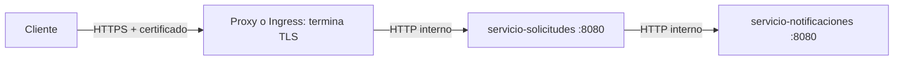

# HTTPS y certificados (opcional)

**Estado actual:** ARKA-Lite escucha por HTTP. `compose.yaml` publica 8080 y 8081; los manifiestos `k8s/` no incluyen Ingress, controlador ni secreto TLS. Esta guía describe una ampliación que puede añadirse cuando se necesite HTTPS. Las llamadas internas de solicitudes a notificaciones seguirán siendo HTTP hasta que se diseñe TLS también entre servicios.

[Fuente Mermaid: 08-flujo-https.mmd](08-flujo-https.mmd)



Un certificado debe corresponder al nombre que usa el cliente. La **clave privada** y los certificados de uso local no deben confirmarse en Git. Para un equipo de desarrollo se puede usar una CA local como [mkcert](https://github.com/FiloSottile/mkcert); para un dominio público se necesita un certificado emitido para ese dominio por una autoridad de confianza. Un certificado local no sirve automáticamente para otros equipos.

## Opción A: punto de entrada HTTPS con Compose

Este ejemplo añade [Caddy](https://caddyserver.com/docs/) como proxy opcional delante de ambos servicios. Instale `mkcert` siguiendo su documentación, cree un directorio de certificados **fuera del repositorio** y genere un certificado para `localhost`:

```powershell
$env:ARKA_CERT_DIR = Join-Path $env:USERPROFILE 'arka-certs'
New-Item -ItemType Directory -Force $env:ARKA_CERT_DIR | Out-Null
mkcert -install
mkcert -cert-file "$env:ARKA_CERT_DIR\localhost.pem" -key-file "$env:ARKA_CERT_DIR\localhost-key.pem" localhost
```

Guarde en la raíz un `Caddyfile` opcional con dos entradas TLS, una por API:

```caddyfile
:8443 {
    tls /certs/localhost.pem /certs/localhost-key.pem
    reverse_proxy servicio-solicitudes:8080
}

:8444 {
    tls /certs/localhost.pem /certs/localhost-key.pem
    reverse_proxy servicio-notificaciones:8080
}
```

Guarde este archivo adicional como `compose.https.yaml` en la raíz:

```yaml
services:
  proxy:
    image: caddy:2
    ports:
      - "8443:8443"
      - "8444:8444"
    volumes:
      - ./Caddyfile:/etc/caddy/Caddyfile:ro
      - ${ARKA_CERT_DIR}/localhost.pem:/certs/localhost.pem:ro
      - ${ARKA_CERT_DIR}/localhost-key.pem:/certs/localhost-key.pem:ro
    depends_on:
      - servicio-solicitudes
      - servicio-notificaciones
```

En la **misma** sesión PowerShell que define `ARKA_CERT_DIR`, valide e inicie la configuración combinada:

```powershell
docker compose -f compose.yaml -f compose.https.yaml config
docker compose -f compose.yaml -f compose.https.yaml up --build -d
Invoke-RestMethod https://localhost:8443/solicitudes
Invoke-RestMethod https://localhost:8444/notificaciones
```

Abra también las dos URL en el navegador y compruebe que el certificado se muestre como válido. Si PowerShell no confía en la CA local, complete la instalación de confianza de `mkcert` para el usuario que ejecuta la prueba. Los puertos HTTP 8080/8081 del `compose.yaml` base **siguen publicados**; si se exige acceso exclusivamente por HTTPS, cambie esa exposición o limítela a `127.0.0.1` como parte de una configuración de despliegue revisada. Para detener esta variante use `docker compose -f compose.yaml -f compose.https.yaml down`.

Para un dominio real, reemplace el nombre, el certificado y la clave por los emitidos para ese dominio; configure su DNS hacia el equipo o balanceador que recibe las conexiones. Proteja el acceso al directorio de claves y gestione la renovación del certificado.

## Opción B: Ingress TLS en Kubernetes

Los `Service` actuales pueden quedar en HTTP dentro del clúster. Instale un **controlador de Ingress** compatible con el clúster local; crear solo el recurso Ingress no abrirá una entrada. Siga la [documentación oficial de Kubernetes sobre Ingress](https://kubernetes.io/docs/concepts/services-networking/ingress/) y la instalación del controlador elegido. Para una prueba local con kind, [ingress-nginx documenta su despliegue](https://kubernetes.github.io/ingress-nginx/deploy/#kind); compruebe que el controlador tenga una ruta de acceso desde Windows antes de continuar.

Obtenga un certificado cuya lista de nombres incluya `solicitudes.example.com` y `notificaciones.example.com` y cree un secreto TLS **en el mismo namespace** que los servicios:

```powershell
kubectl create secret tls arka-tls --cert=RUTA-AL-CERTIFICADO.pem --key=RUTA-A-LA-CLAVE.pem
```

Guarde este ejemplo como `k8s-opcional/ingress-https.yaml` cuando haya instalado el controlador. Mantenerlo fuera de `k8s/` evita que la guía básica lo aplique por accidente. `nginx` es el nombre de clase del ejemplo; confirme la clase real con `kubectl get ingressclass` y cámbiela si corresponde:

```yaml
apiVersion: networking.k8s.io/v1
kind: Ingress
metadata:
  name: arka-https
spec:
  ingressClassName: nginx
  tls:
    - hosts:
        - solicitudes.example.com
        - notificaciones.example.com
      secretName: arka-tls
  rules:
    - host: solicitudes.example.com
      http:
        paths:
          - path: /
            pathType: Prefix
            backend:
              service:
                name: servicio-solicitudes
                port:
                  number: 8080
    - host: notificaciones.example.com
      http:
        paths:
          - path: /
            pathType: Prefix
            backend:
              service:
                name: servicio-notificaciones
                port:
                  number: 8080
```

Aplique con `kubectl apply -f k8s-opcional/ingress-https.yaml` y revise `kubectl describe ingress arka-https`. Configure DNS o resolución local para que ambos nombres apunten a la dirección de entrada del controlador; pruebe `https://solicitudes.example.com/solicitudes` y `https://notificaciones.example.com/notificaciones` desde un cliente que confíe en la CA emisora. Los nombres `example.com` son marcadores: sustitúyalos también al emitir el certificado.

Nunca almacene la clave privada ni el archivo de un secreto TLS en Git. `kubectl port-forward` seguirá hablando HTTP directamente con el Service y no es una prueba del certificado del Ingress. Si se requiere cifrado **entre** microservicios, hace falta otro diseño: certificados para ambos servicios, distribución y rotación de confianza y cambio de `NOTIFICACIONES_URL`; ese comportamiento no existe hoy.
