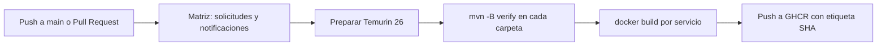

# Pipeline que existe hoy

El archivo activo es [`.github/workflows/ci.yml`](../../.github/workflows/ci.yml), llamado `CI-Arkalitos`. GitHub Actions lo inicia en un `push` a `main` y en eventos de `pull_request`. No hay en el repositorio un despliegue automático a un ambiente.

[Fuente Mermaid: 04-flujo-pipeline.mmd](04-flujo-pipeline.mmd)

Cada valor de la matriz crea un trabajo para un microservicio. El trabajo descarga el código con `actions/checkout`, prepara Temurin 26 con `actions/setup-java`, ejecuta `mvn -B verify` en la carpeta del servicio, inicia sesión en `ghcr.io` con `GITHUB_TOKEN`, construye con su Dockerfile y publica una imagen. La referencia tiene la forma `ghcr.io/<propietario>/<repo>/<servicio>:<sha-del-commit>` en minúsculas.

El workflow solicita `contents: read` y `packages: write`. La publicación depende de los permisos efectivos de GitHub y del origen del evento; un Pull Request de un fork puede ejecutar las pruebas y fallar al autenticar o publicar. La documentación debe distinguir **resultado de pruebas** de **resultado de publicación** al diagnosticar una ejecución. Este pipeline no modifica automáticamente `compose.yaml` ni `k8s/` y no despliega ninguna de esas imágenes.

## Ver una ejecución

Abra la pestaña **Actions** del repositorio, seleccione `CI-Arkalitos`, elija la ejecución y revise los dos trabajos de la matriz. Si fallan las pruebas, abra el paso `Compilar y Probar cada servicio`; si falla la imagen, revise `login al registro` y `Construir y publicar`. Para reproducir el paso de pruebas localmente use `.\mvnw.cmd clean verify` dentro de cada carpeta, como explica [ejecución local](../06-uso/01-ejecucion-y-depuracion.md). El Dockerfile empaqueta con `-DskipTests`, por lo que el paso Maven anterior es la comprobación de pruebas.

Para aprender la sintaxis de Actions, lea [GitHub Actions y YAML](02-github-actions-yaml.md). Las opciones de ramas, ambientes, aprobaciones y despliegues en [CI/CD y ambientes](03-ci-cd-y-ambientes.md) son **propuestas**, no pasos activos del workflow.
